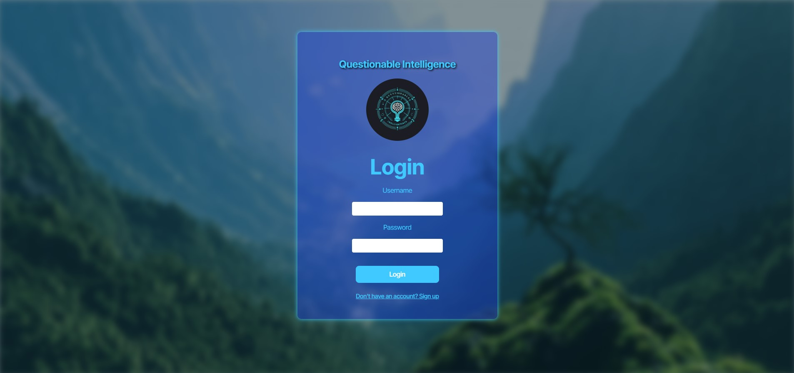
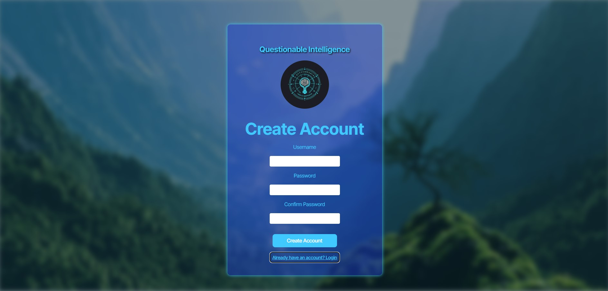
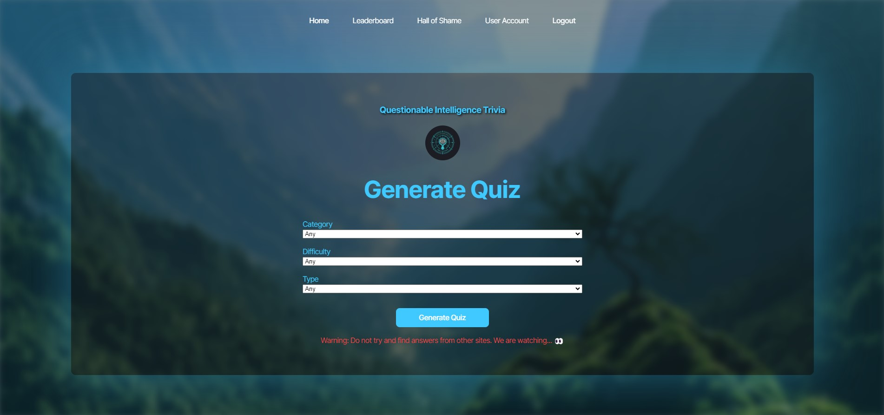
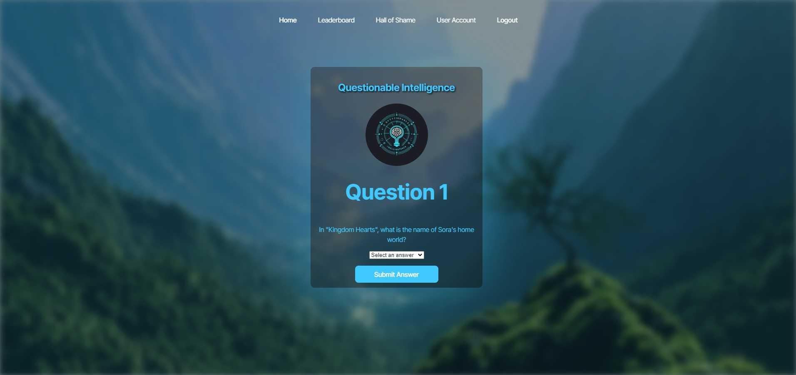
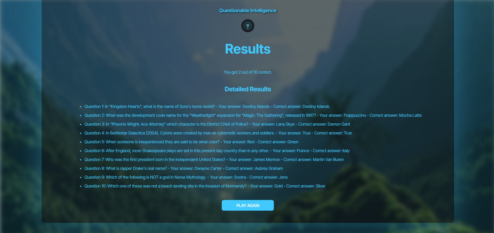
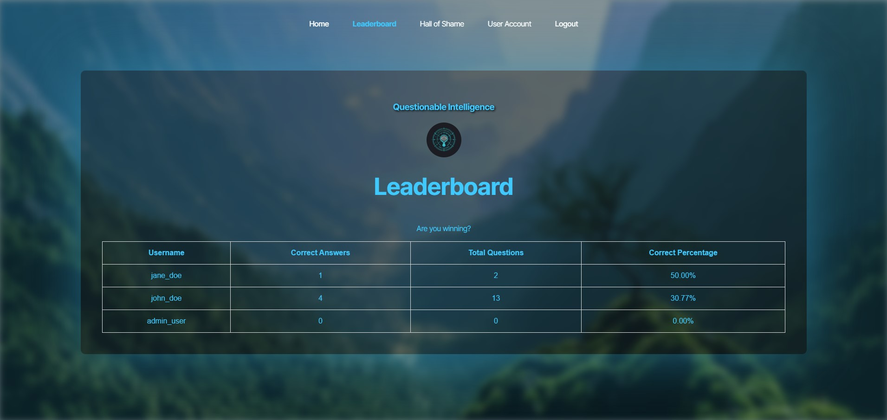
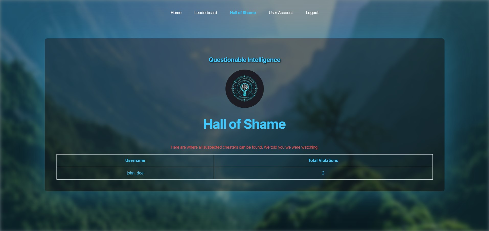
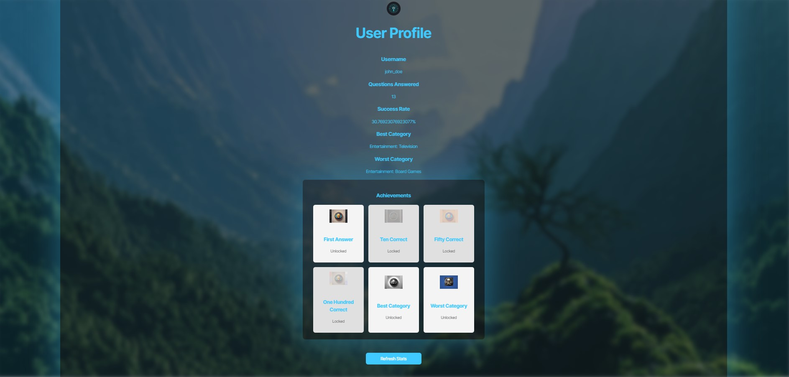

# Questionable Intelligence

## Deployment

This application is deployed on Render.com. Click the link below to check it out.

https://questionable-intelligence.onrender.com

## Technology Used

The application was created using the following technology tools: 

    Node.js and Express.js to create a RESTful API.

    React for the front end.

    PostgreSQL and the Sequelize ORM for the database.

    Authentication using JWT.

    TypeScript

## Description
Questionable Intelligence is an online trivia game that challenges your intelligence on various genres. You can create your own account, then login and track your progress on the leaderboard while also earning achievements that you can then brag to your colleagues and friends about. It is great for taking a quick break or for playing with friends at parties!
Try it! You'll love it!

## Table of Contents
- [Installation](#installation)
- [Usage](#usage)
- [License](#license)
- [Contributing](#contributing)
- [Tests](#tests)
- [Questions](#questions)

## Installation
N/A

## Usage

Upon loading up the page you will be brought initially to the login page. Here you can enter your username and password if you already have an account and click the login button to begin. If you don't have an account, you can click the sign up link to create an account. Under create account you can create your username and password then click the create account button. You will be required to confirm the password and it must be over 8 characters long. If a username already exists you will be notified.  If you are successful it will notify you that the account was created. You can then click the login link at the bottom to go back to the login page to login.

Once logged in, you will be taken to a genereate quiz form where you can select a category, the difficulty, and the type of questions you want to answer. You can then click the generate quiz button to get started! You will notice several links at the top of the page as well. These can be selected at any time should you want to go to another page rather than take a quiz.

Once the quiz begins, you will be given a series of ten questions based on the selections you made prior. You can choose your answer from the dropdown menu, then click the submit answer button to move on to the next question.

After completing all ten question, you will then be brought to a results page where you can see how many you got right along with a list of the questions, your answer, and the correct answer. If you want to play again simply click the play again button and you will be brought back to the generate quiz page.

If you would rather not do another quiz, you can click the leaderboard link at the top to see where you stand compared to other players. This will take you to a table that shows usernames, their number of correct answers, the total number of questions they've answered, and the percentage they have correct. 

You can also click on the hall of shame link to check out any users that have been caught cheating. On this table you can see a username along with the number of total violations they have had.

Finally, you can click on the user acount link to view your user profile. This consists of your username, questions answered, the percentage success rate, your best category, your worst category, and any achievements you have unlocked or still have locked. There is also a button at the bottom to refresh your stats. When you are all finished with the app, feel free to click the logout button which will take you back to the login page. Otherwise, you will automatically be logged out after one hour of no activity.

Click the link below to see a demo video of the app in use!

https://drive.google.com/file/d/17rncCIhbXPlSi3JtHDxeG2wHviCi1EDF/view?usp=sharing

  ## License
    MIT
    
  https://opensource.org/licenses/MIT

## Contributing
At this time no further contributions are needed.

## Tests
N/A

## Authors

Check out our GitHub accounts to see other projects we have done.

[Ryan Paulette](https://github.com/pauletters)
[Eric Neff](https://github.com/eric7string)
[Cole Brown](https://github.com/cbrow089)
[Lenworth Miller](https://github.com/lenworth425)

© 2024 Questionable Intelligence Team Confidential and Proprietary. All Rights Reserved.
